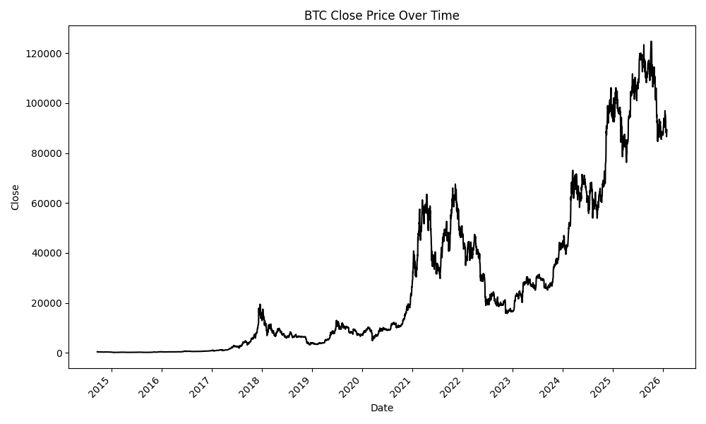
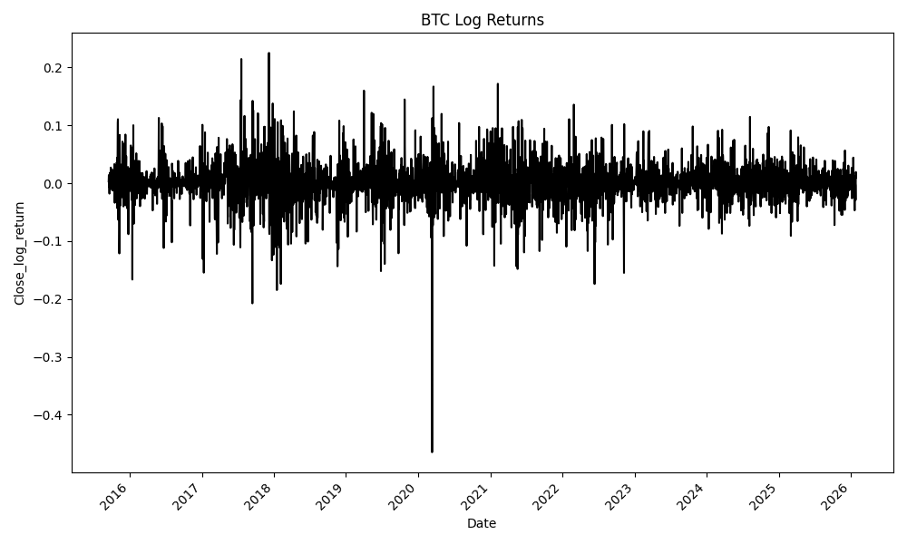
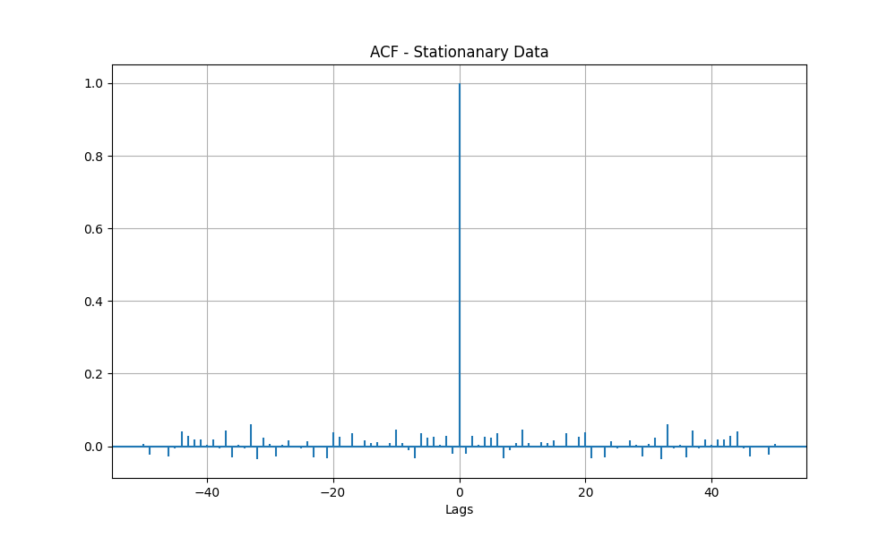
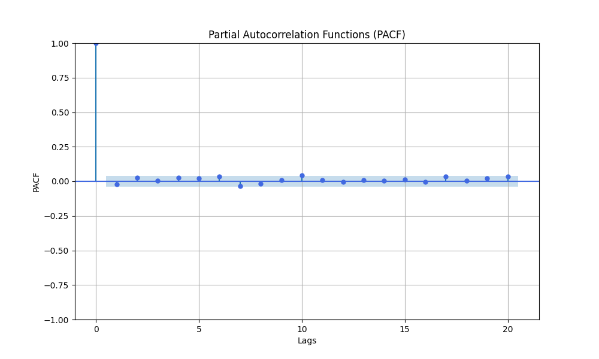
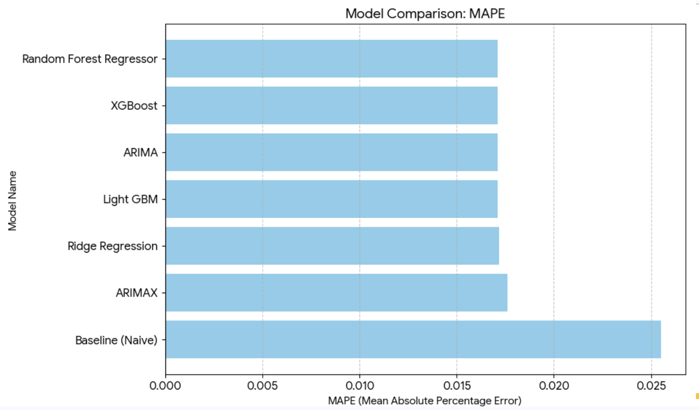
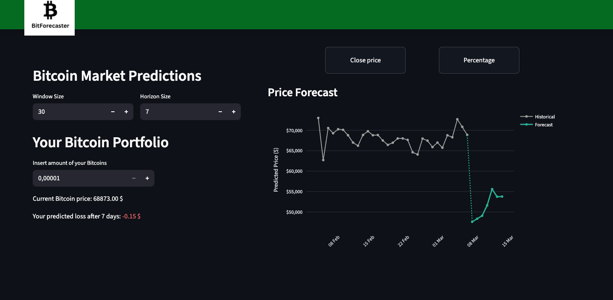
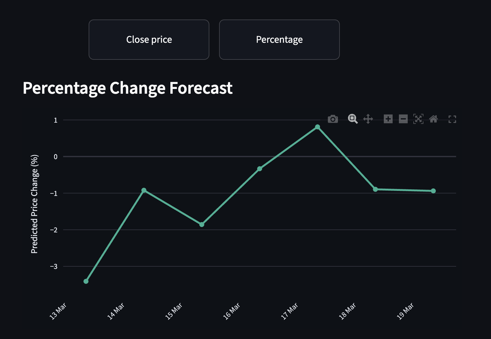
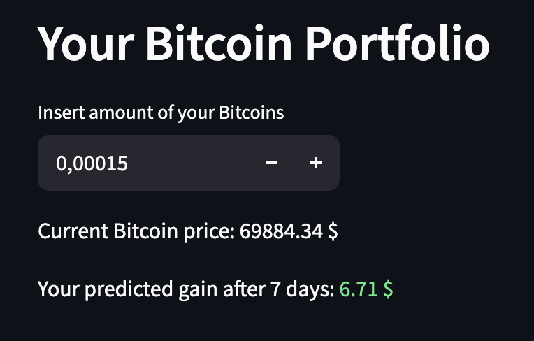

# Bitcoin Price Prediction

Predicting Time Series Close Price of Bitcoin.

## Dataset
We utilize historical price data including Open, High, Low, Close, and Volume (OHLCV) in [$]. Data were collected from September 2014 to end of January 2026.

### Dataset sample:
| Date | Open | High | Low | Close | Volume |
| :--- | :--- | :--- | :--- | :--- | :--- |
| 2014-09-17 | 465.86 | 468.17 | 452.42 | 457.33 | 21,056,800 |
| 2014-09-18 | 456.86 | 456.86 | 413.10 | 424.44 | 34,483,200 |
| 2014-09-19 | 424.10 | 427.83 | 384.53 | 394.80 | 37,919,700 |
| 2014-09-20 | 394.67 | 423.30 | 389.88 | 408.90 | 36,863,600 |
| 2014-09-21 | 408.08 | 412.43 | 393.18 | 398.82 | 26,580,100 |

Source of data: [Kaggle](https://www.kaggle.com/datasets/adilshamim8/bitcoin-historical-data/code)

Price of Bitcoin has rised around 5 times from 2014. It has a few bigger drop offs.


Model after using log and diff transformations to achieve stationarity. 



This one down pick is the first day of COVID-19 (12.03.2020), it's commonly called Black Thursday, when just for one day BTC price has dropped over 40%.

### ACF


There is a regular weekly rise in the correlation between the data. A price dependency is seen every Monday.

### PACF



## Model Comparison



**Baseline** (Naive Persistence Model) - The predicted price for today is simply the actual closing price from yesterday.

Most models have a similar MAPE result. Simply predicting only one value of Bitcoin in the future is a hard task, but they have outperformed the baseline method. 

What is interesting is that ARIMAX was worse than simple ARIMA, but it can be due to poorly chosen or weakly informative exogenous variables, overfitting caused by adding extra predictors, or the fact that the external variables used do not have strong predictive power for Bitcoin prices in the tested period.

--- 

In the final version of the project, a Transformer model was used to predict multiple days into the future. The model was trained using a 356-day input window and a 180-day prediction horizon.

The input window size can be adjusted by the user, as it is handled through the embedding representation of the input sequence. However, the model always predicts 180 days ahead. The number of historical days selected by the user is displayed in the interface.

Additionally, the UI includes a restriction that prevents the user from making predictions when the number of historical days selected is smaller than the number of days being predicted.

## Website
The user can set the `Window Size`, which determines how many days from the historical data are used to make the prediction and are displayed in the plot.

The `Horizon Size` specifies how many days into the future the model will generate predictions.



The user can choose between two plot types: `Close Price` and `Percentage`. The `Close Price` plot displays the Bitcoin price over time, while the `Percentage` plot shows the day-to-day percentage changes in the price



The user can enter the amount of Bitcoin they currently hold and specify the number of days after which they would like to sell it. Based on this information, the app calculates the predicted profit or loss in USD.




## Getting Started
### 1. Clone the repository
```bash
git clone https://github.com/metrych-creator/bitcoin_prediction.git
cd bitcoin-prediction
```

### 2. Run the application with Docker
```bash
docker compose up
```

The application will start and be available at: http://localhost:8501


---


## Optional: Local Development (without Docker)
### 1. Clone the repository
```bash
git clone https://github.com/metrych-creator/bitcoin_prediction.git
cd bitcoin-prediction
```

### 2. Create a Virtual Environment
```bash
python -m venv venv
venv\Scripts\activate
```

### 3. Install Dependecies
```bash
pip install --upgrade pip
pip install -r requiremnts.txt
```

### 4. Run app
```bash
streamlit run view/app.py
```
